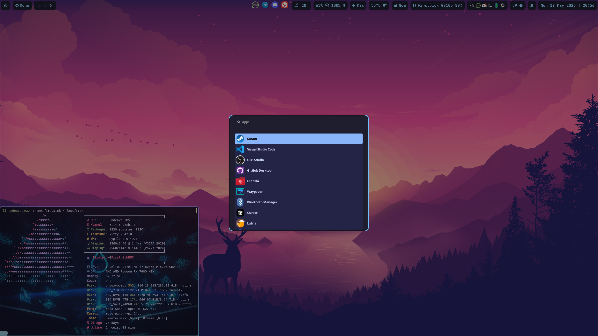
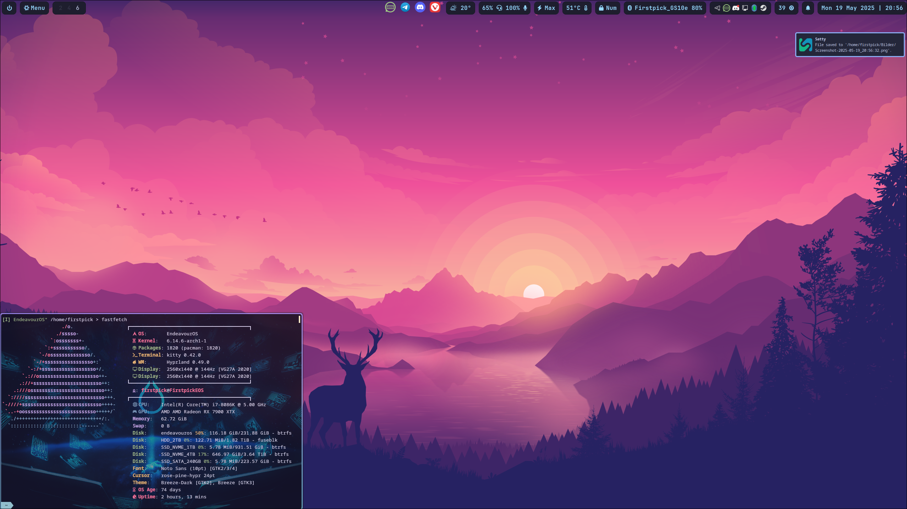
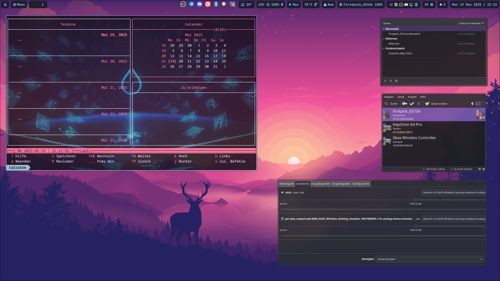
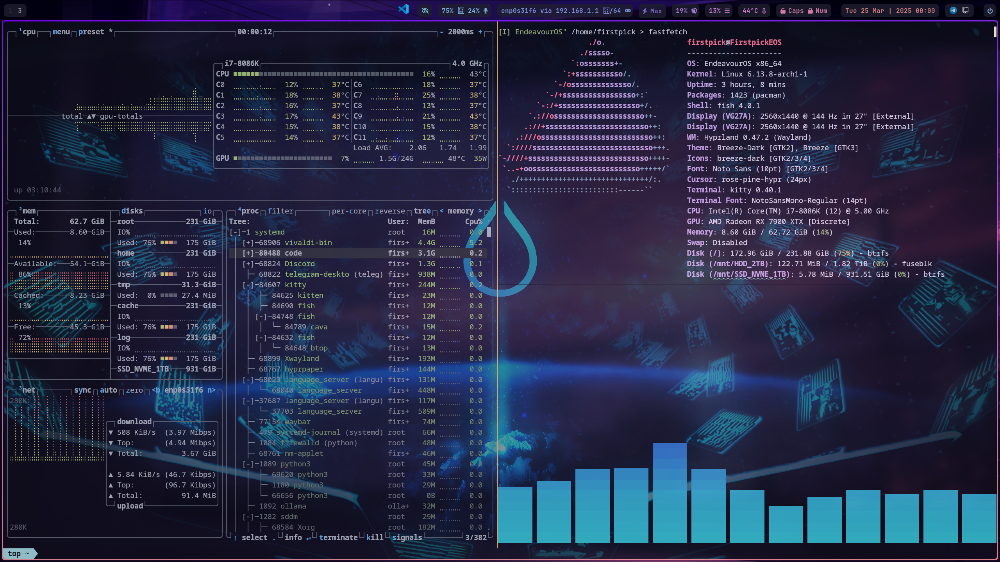

# Hyprland Setup

<details>
  <style>
    /* Hyprland-inspired styles */
    body {
      background-color: #232136;
      font-family: 'JetBrains Mono', monospace;
      color: #e0def4;
    }
    h1, h2, h3, h4, h5, h6 {
      color: #b9f2ff;
    }
    a {
      color: rgb(123, 130, 255);
      text-decoration: underline;
    }
  </style>
</details>

<div align="center" style="background-color: #232136; border-left: 5px solid rgb(111, 142, 235); padding: 1em; margin-bottom: 1em; color: #e0def4;">
  <h2 style="color: rgb(185, 242, 255);">Hello Fellow Hyprland Newcomers!</h2>
  <p style="font-size: 1.2em; font-weight: bold;">Welcome to my Hyprland Setup!</p>
  <p>I hope you find it useful and enjoyable.</p>
  <p style="color: #f6c177;">
    ❗ If something does not work, please <a href="https://github.com/Firstp1ck/Hyprland_simple-minimal_Setup/issues/new" rel="noopener noreferrer" style="color: rgb(123, 130, 255); text-decoration: underline;">open an issue</a> on this repository ❗<br>
    ❗I am always open to suggestions and feedback ❗
  </p>
</div>

## Example Images

 



## Example Terminal and Musik Visualizer




## Table of Contents
- [Introduction](#introduction)
  - [Quick Start](#quick-start)
- [Environment Setup](#environment-setup)
- [Prerequisites](#prerequisites)
- [Setup Script Execution](#setup-script-execution)
- [Package Installations](#package-installations)
  - [Pacman Packages](#pacman-packages)
  - [AUR Packages](#aur-packages)
- [Manuell Installation & Configuration](#manuell-installation--configuration)
- [Change Wallpaper with the Wallpaper Script](#change-wallpaper-with-the-wallpaper-script)
- [Terminal Experience](#terminal-experience)
- [Customization](#customization)
  - [Wallpaper Management](#wallpaper-management)
  - [Window Rules](#window-rules)
  - [Keybindings](#keybindings)
  - [Autostart Applications](#autostart-applications)
  - [Monitor Configuration](#monitor-configuration)
- [Troubleshooting](#troubleshooting)
  - [Display and Monitor Issues](#display-and-monitor-issues)
  - [Wallpaper Management](#wallpaper-management-1)
  - [Authentication Issues](#authentication-issues)
  - [Performance Problems](#performance-problems)
  - [Application Integration](#application-integration)
  - [Configuration Debugging](#configuration-debugging)
  - [Keybinding Issues](#keybinding-issues)
  - [Recovery Options](#recovery-options)
- [Additional Resources](#additional-resources)

## Introduction

This repository provides a minimalistic Hyprland setup designed for users who want a customizable desktop environment.

It sets up the following Components/Apps:

**Core Components**
- Graphic Drivers (Open Source)
- Audio (Pipewire)
- Login Manager (sddm)
- User Environment (xdg-user-dirs)
- Keyring Setup (Gnome-keyring)
- Filepicker Setup (KDE Filepicker for Dolphin)
- Monitor Setup (Custom Script)
- Lock Mechanisms (Hyprlock and Hypridle)
- Brightness Control (Hyprsunset)

**Core Applications**
- Application Launcher (Wofi)
- Task Bar (Waybar)
- Wallpaper Setup (Hyprpaper, Waypaper-git and Custom Script)
- Notification Manager (Dunst)
- Clipboard Manager (wl-clipboard)
- Screenshot Tool (Hyprshot with Satty)
- Calculator (Qalculate-gtk)
- Firewall (Firewalld)
- Browser (Vivaldi)

**CLI Applications**
- Custom Stow (Stow - Custom Script for easy Config Management)
- Calendar (Calcurse)
- Neovim (Kickstarter)
- Notes with Neovim (Custom Script)
- Shell Configuration (Fish Shell - with useful aliases)
- CLI Tools for a more convenient terminal experience

**Waybar Applications**
- Bluetooth (In Waybar) (Bluetooth-Manager)
- Network (In Waybar) (Network-Manager)
- Power Button (In Waybar)
- Update Button (In Waybar) (waybar-module-pacman-updates-git)
- Temperatur Sensor (In Waybar) (psensor)¨
- Power Profiles (In Waybar)
- Weather (In Waybar) (Swiss Specific - Needs adjustments for other countries)

**Additional Applications**
- Keybindings (Extensive Keybinds with App for Overview)
- Snapshots for Btrfs-Filesystems (Timeshift)
- Snapshot Setup for Grub (grub-btrfs)
- Scratchpad for Minimizable Terminal (pyprland)
- Custom Mouse Cursor (rose-pine-hyprcursor)


### Quick Start

1. **Clones the repository into your home directory.**
   ```bash
   git clone https://github.com/firstp1ck/Hyprland_Simple_Setup.git ~/Hyprland_Simple_Setup
   ```
2. **Run the setup script to install dependencies and configure your system:**
   ```bash
   cd ~/Hyprland_Simple_Setup
   ./setup.sh
   ```

   - The script will:
     - Detect your system and prerequisites
     - Install all required packages (Pacman and AUR)
     - Verify installations
     - Guide you through configuration steps

3. If you add new configuration files add them to the `dotfiles` folder to match your system (e.g. displays, wallpapers, and environment variables, see section: [Manuell Installation & Configuration](#manuell-installation--configuration)).

4. **Deploy dotfiles using GNU stow:**
   ```bash
   cd ~/Hyprland_Simple_Setup/dotfiles
   bash .local/scripts/Start_stow_solve.sh
   ```

5. **Edit configuration files as needed (see below for modular config structure).**

6. **Log out and log in to Hyprland, or start it from a TTY.**

7. **After Relogging the Environment should be updated and a Keybind App should be opened (if the App did not open, you can open it via Right-click on the Menu Button in the Bar)

## Environment Setup

- The Setup is designed to run from EndeavourOS and Arch (with Hyprland selceted in the archinstall script). 
- You may need to modify the script for other distros or environments.
- Uses stow to manage dotfiles. The stow setupscript makes backups from the original dotfiles in the home directory.

## Prerequisites
- Arch-based Linux distribution (tested on EndeavourOS and Arch, with Archinstall-Script)
- Base development tools (`git`, `sudo`)
- YAY AUR helper (will be installed if missing)
- A directory containing your wallpapers (Will use Default Wallpapers from the Repository otherwise)
- Internet connection for package downloads

## Installation Details

- **Supported:** Arch Linux, EndeavourOS (other distros may require manual adaptation)
- **Dependencies:** All handled by the setup script (Pacman and AUR)
- **Dotfile management:** GNU stow (with backup of existing files)
- **Logging:** All actions logged to `~/Linux-Setup.log`

## Project Structure

- `Setup/Start_hyprland_setup.sh` – Main interactive setup script
- `dotfiles/`
  - `.config/`
    - `hypr/` – Hyprland configs and scripts
      - `hyprland.conf` – Main config
      - `sources_example/` – Example modular configs (keybindings, monitors, autostart, etc.)
      - `scripts/` – Helper scripts (wallpaper, sunset, dolphin fix, etc.)
    - `waybar/` – Status bar config, style, and scripts (weather, updates, Dunst history)
    - `wofi/` – Application launcher config and style
    - `kitty/`, `fish/`, `dunst/`, `nvim/`, `btop/`, `cava/`, `fastfetch/`, `zellij/`, `bat/`, `satty/`, `xdg-desktop-portal/` – App configs
    - `fish/` - Shell Configurations
  - `.bashrc`, `.bash_profile` – Shell Configurations
  - `.local/scripts/Start_stow_solve.sh` – Stow deployment script

## Setup Script Execution

To install and configure Hyprland along with its dependencies, run:
```bash
cd ~/Hyprland_Simple_Setup
./setup.sh
```
This script automatically updates Pacman, installs the necessary packages, and configures Hyprland tools.

## Package Installations

### Pacman Packages
**Core Hyprland Packages**
- hyprland (Wayland compositor)
- waybar (Status bar)
- hyprpaper (Wallpaper manager)
- hyprcursor (Cursor themes)
- wofi (Application launcher)
- hyprlock (Screen locker)
- hypridle (Idle manager)
- hyprpolkitagent (Authentication agent)
- hyprpicker (Color picker)
- wl-clipboard & wl-clip-persist (Clipboard managers)
- hyprgraphics (Graphics utilities)
- hyprland-qtutils (Qt integration)
- hyprland-qt-support (Qt support)
- hyprwayland-scanner (Wayland protocol scanner)
- python-pyquery
- polkit-kde-agent

**File Management**
- dolphin (File manager)
- git (Version control)
- fd (Modern find)
- fzf (Fuzzy finder)
- stow (Dotfiles management)
- nvim (Text editor)
- xdg-user-dirs
- onefetch
- ark
- 7zip
- timeshift
- grub-btrfs
- inotify-tools
- satty

**Terminal and Shell**
- kitty (Terminal emulator)
- fish (Shell)
- konsole (KDE terminal)

**Browsers**
- vivaldi
- vivaldi-ffmpeg-codecs

**System Integration**
- xdg-desktop-portal-hyprland
- xdg-desktop-portal-gtk
- gnome-keyring
- network-manager-applet
- networkmanager
- nm-connection-editor
- ntfs-3g (NTFS filesystem support)
- firewalld (Firewall management)
- bluez
- bluez-utils
- blueman
- pipewire
- pipewire-pulse
- pavucontrol
- pulseaudio-qt

**CLI Tools**
- bat (Modern cat)
- lsd (Modern ls)
- btop (System monitor)
- khal (Calendar)
- zoxide (Smart cd)
- lshw (Hardware lister)
- fastfetch (System info)
- tldr (Simplified man pages)
- dysk
- duf
- zellij
- calcurse

**Theming and Appearance**
- ttf-jetbrains-mono-nerd
- ttf-nerd-fonts-symbols
- ttf-nerd-fonts-symbols-common
- cava (Audio visualizer)

**Calculator**
- qalculate-gtk

### AUR Packages
- xwaylandvideobridge-git (Screen sharing)
- hyprshot (Screenshot utility)
- visual-studio-code-bin (Code editor)
- lsplug (Plugin manager)
- waypaper-git (Wallpaper manager)
- pyprland (Python bindings)
- wl-clipboard-history-git (Clipboard history)
- hyprsunset (Night light)
- github-desktop-bin (GitHub client)
- rose-pine-hyprcursor (Mouse Cursor)

## Manuell Installation & Configuration

1. Clone or copy this repository to your machine.
  ```bash
  git clone https://github.com/firstp1ck/Hyprland_Simple_Setup.git ~/Hyprland_Simple_Setup
  ```
2. Copy the dotfiles to the Home directory
  ```bash
  cd ~/Hyprland_Simple_Setup
  cp dotfiles/ ~/dotfiles
  ```

2. Update the following files with your system-specific details:
   - **Wallpaper Configuration:**  
     Create or edit `~/.config/hypr/sources/change_wallpaper.conf` with:
     ```bash
     # Your wallpaper directory path
     WALLPAPER_DIR="$HOME/Pictures/Wallpapers"
     
     # Your monitor names (check with hyprctl monitors)
     MONITORS=(
         "DP-1"
         "HDMI-A-1"
         # Add more monitors as needed
     )
     ```
   - **Hyprlock Wallpaper Path:**  
     Update the `background` path in `~/.config/hypr/hyprlock.conf` to match your wallpaper directory.
     
   - **Display Configuration:**  
     Create or edit `~/.config/hypr/sources/displays.conf` to match your monitor setup:
     ```bash
     monitor=DP-1,2560x1440@144,0x0,1
     monitor=HDMI-A-1,1920x1080@60,2560x0,1
     # Add more monitor configurations as needed
     ```

   - **Environment Variables:**  
     Check `~/.config/fish/config.fish` for correct language settings:
     ```fish
     set -gx LC_ALL de_CH.UTF-8  # Change to your locale
     set -gx LANG de_CH.UTF-8    # Change to your locale
     set -gx LANGUAGE de_CH:en_US # Change to your language preferences
     ```
   - **Install required Packages**  
     Install all necessary packages from the [Pacman Packages](#pacman-packages) and [AUR Packages](#aur-packages) sections using your package manager.

   - **Run the Stow Script**  
     Execute the stow script to symlink all configuration files to their correct locations:
     ```bash
     cd ~/dotfiles
     bash .local/scripts/Start_stow_solve.sh
     ```

## Change Wallpaper with the Wallpaper Script

The `change_wallpaper.sh` script:
- Checks if hyprpaper is running and starts it if necessary.
- Picks a random wallpaper from your specified directory (excluding the current one).
- Applies the new wallpaper to the specified monitors.

To run the script (Default Key Shortcut: Super(mainMod) + W):
```bash
./.config/hypr/change_wallpaper.sh
```

## Terminal Experience
- **Kitty Terminal Integration**
  - Multiple layouts (splits, tabs, windows)
  - Session management and restoration
  - Custom key mappings:
    ```bash
    # Quick terminal splits
    ctrl+y -> new window
    alt+h/j/k/l -> window navigation
    ctrl+shift+y -> new tab
    ```

- **Fish Shell Enhancements**
  - Smart command history with search
  - Built-in completions and suggestions
  - Custom aliases for improved workflow:
    ```fish
    alias ls='lsd -lh --group-directories-first'
    alias top='btop'
    alias cat='bat'
    ```

- **Modern CLI Tools**
  - `bat`: Syntax highlighting for file viewing
  - `lsd`: Enhanced file listing with icons
  - `btop`: Resource monitoring with graphs
  - `fzf`: Fuzzy finding with preview
  - `fd`: Fast file search alternative

## Customization

### Wallpaper Management
- Modify supported file extensions in `change_wallpaper.sh`:
  ```bash
  # Add or remove file extensions
  WALLPAPER=$(find "$WALLPAPER_DIR" -type f \( -iname "*.jpg" -o -iname "*.png" -o -iname "*.webp" \))
  ```

### Window Rules
- Add custom window rules in `~/.config/hypr/sources/windows_and_workspaces.conf`:
  ```ini
  # Example window rules
  windowrulev2 = float,class:^(org\.pulseaudio\.pavucontrol)$
  windowrulev2 = center,class:^(org\.pulseaudio\.pavucontrol)$
  windowrule = workspace 2, ^(vivaldi-stable)$
  windowrule = opacity 0.95, ^(Code)$
  ```

### Keybindings
- Customize shortcuts in `~/.config/hypr/sources/keybindings.conf`:
  ```ini
  # Media controls
  bind = , XF86AudioPlay, exec, playerctl play-pause
  bind = , XF86AudioNext, exec, playerctl next
  
  # Screenshot bindings
  bind = , Print, exec, hyprshot -m output
  bind = SHIFT, Print, exec, hyprshot -m region
  ```

### Autostart Applications
- Add or modify autostart programs in `~/.config/hypr/sources/exec_once.conf`:
  ```bash  
  # User applications
  exec-once = vivaldi-stable
  exec-once = [workspace 3] code
  ```

### Monitor Configuration
The setup provides an interactive monitor configuration workflow:

1. Detection:
   ```bash
   # Check available monitors
   hyprctl monitors
   ```

2. Configuration Process:
   - Script prompts for monitor names
   - For each monitor, specify:
     - Resolution (default: 2560x1440)
     - Refresh rate (default: 144)
     - Position (automatically calculated)

3. Configuration Storage:
   - Settings saved to `~/.config/hypr/sources/displays.conf`
   - Format example:
     ```bash
     monitor=DP-1,2560x1440@144,0x0,1
     monitor=HDMI-A-1,1920x1080@60,2560x0,1
     ```

### Remove Default Tweaks
- Configure misc options to remove default settings:
  ```ini
  misc {
      vfr = true # Enable VFR (Variable Frame Rate) for Hyprland
      force_default_wallpaper = 0 # Set to 0 or 1 to disable the anime mascot wallpapers
      disable_hyprland_logo = true # If true disables the random hyprland logo / anime girl background. :(
  }
  ```

For more customization options, refer to:
- [Hyprland Configuration Reference](https://wiki.hyprland.org/Configuring/Variables/)
- [Waybar Configuration Guide](https://github.com/Alexays/Waybar/wiki/Configuration)
- [Wofi Documentation](https://hg.sr.ht/~scoopta/wofi)

## Troubleshooting

- **Logs:** See `~/Linux-Setup.log`
- **Package verification:** The setup script checks and reports missing packages
- **Configuration issues:** Modular config makes it easy to isolate and fix problems
- **Scripts:** Helper scripts for common issues (e.g., fix dolphin, restart Dunst, etc.)

### Display and Monitor Issues
- Verify monitor names and configurations:
  ```bash
  # List all monitors and their current status
  hyprctl monitors
  
  # Check for any monitor hotplug events
  tail -f ~/.local/share/hyprland/hyprland.log | grep -i "monitor"
  ```
- If monitors are not detected properly:
  1. Ensure your GPU drivers are properly installed
  2. Try adding manual monitor configuration to `hyprland.conf`
  3. Check if your display cable is properly connected

### Wallpaper Management
- Wallpaper not changing:
  ```bash
  # Check if wallpaper directory exists and has correct permissions
  ls -la $WALLPAPER_DIR
  
  # Verify hyprpaper is running
  ps aux | grep hyprpaper
  
  # Check hyprpaper socket status
  ls -l /tmp/hypr
  ```
- Invalid wallpaper formats:
  1. Ensure images are in supported formats (jpg, png, webp)
  2. Check image file permissions
  3. Run `file` command on images to verify format

### Authentication Issues
- If polkit authentication fails:
  ```bash
  # Check if polkit agent is running
  ps aux | grep polkit
  
  # Restart polkit service
  systemctl restart polkit
  ```
- For keyring issues:
  1. Verify gnome-keyring is installed and running
  2. Check if PAM is properly configured

### Performance Problems
- For slow startup or lag:
  ```bash
  # Check startup time
  hyprctl version
  
  # Monitor resource usage
  btop
  
  # Check for GPU issues
  nvidia-smi  # For NVIDIA GPUs
  radeontop   # For AMD GPUs
  ```
- Reduce animation complexity in `~/.config/hypr/sources/look_and_feel.conf` if needed

### Application Integration
- XWayland applications not working:
  ```bash
  # Check if XWayland is running
  ps aux | grep Xwayland
  
  # Verify application compatibility
  echo $XDG_SESSION_TYPE
  ```
- Screen sharing issues:
  1. Ensure xdg-desktop-portal-hyprland is installed
  2. Check if necessary protocols are supported
  3. Verify xwaylandvideobridge is running for screen sharing

### Configuration Debugging
- Parse configuration errors:
  ```bash
  # Check Hyprland logs
  less ~/.local/share/hyprland/hyprland.log
  
  # Validate config syntax
  hyprctl reload
  ```
- Common configuration fixes:
  1. Check file permissions of config files
  2. Verify paths in configuration files are absolute
  3. Ensure no syntax errors in configuration files

### Keybinding Issues
- Test if keybindings are registered:
  ```bash
  # List all active bindings
  hyprctl binds
  
  # Monitor key events
  wev  # Install wev package if needed
  ```
- For non-working shortcuts:
  1. Check for conflicts with system shortcuts
  2. Verify correct syntax in keybindings configuration
  3. Ensure required programs are installed

### Recovery Options
- If Hyprland fails to start:
  1. Switch to another TTY (Ctrl+Alt+F2)
  2. Check logs: `less ~/.local/share/hyprland/hyprland.log`
  3. Try with minimal config: `mv ~/.config/hypr/hyprland.conf ~/.config/hypr/hyprland.conf.bak`

For persistent issues:
- Check [Hyprland GitHub Issues](https://github.com/hyprwm/Hyprland/issues)
- Join the [Hyprland Discord](https://discord.gg/hQ6M6xbvEM)
- Review system logs: `journalctl -b -p err`

## Additional Resources
- [Hyprland Wiki](https://wiki.hyprland.org/)
- [Hyprland GitHub Repository](https://github.com/vaxerski/Hyprland)
- [Waybar GitHub Repository (Wiki)](https://github.com/Alexays/Waybar/wiki)
- [Kitty Homepage (Wiki)](https://sw.kovidgoyal.net/kitty/)
- [Fish Shell (Wiki)](https://fishshell.com/docs/current/index.html)

## Contributing & Support

- Open issues or pull requests on GitHub
- Suggestions and feedback welcome!

## License

See [LICENSE](LICENSE) for details.