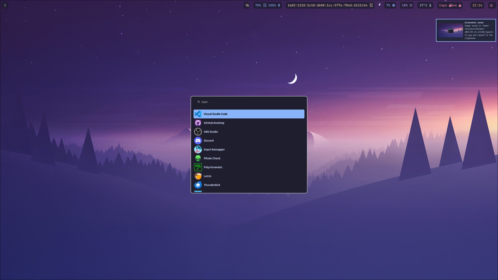

# Hyprland Setup

## Example Image



## Introduction
This repository provides a minimalistic Hyprland setup that installs and configures Hyprland along with essential packages and AUR extras. It aims to deliver a lightweight and efficient desktop environment with dynamic wallpaper management and streamlined configuration.

## Environment Setup

- The Setup is designed to run from EndeavourOS with KDE preinstalled. 
- You may need to modify the script for other distros or environments.

## Prerequisites
- [Hyprland](https://hyprland.org/) installed.
- Utilities like `hyprctl`, `hyprpaper`, and a shell environment.
- A directory containing your wallpapers.
- Vivaldi is used for browser in hyprland.conf, change it if you want to use another browser.
- Check Monitors in hyprland.conf at the start. Adapt it to your setup.

## Dependencies

### Pacman Packages
- hyprland
- dolphin (File Manager)
- vivaldi (Browser)
- kitty (Terminal)
- waybar (Status Bar)
- code (Visual Studio Code - Text Editor)
- hyprpaper (Wallpaper Manager)
- wofi (App Launcher)
- hyprlock (Lock Screen)
- hypridle (Idle Manager)
- hyprpolkitagent (Authentication Agent)
- polkit-kde-agent (Authentication Agent)
- gnome-keyring (Authentication Agent)
- xdg-desktop-portal-hyprland (Desktop Integration)
- xdg-desktop-portal-gtk (Desktop Integration)
- dunst (Notification Daemon)
- python-pywal (Wallpaper Changer, not yet implemented)
- ttf-jetbrains-mono-nerd (Fonts)


`sudo pacman -S hyprland dolphin kitty vivaldi waybar hyprpaper wofi hyprlock hypridle hyprshot hyprpolkitagent xdg-desktop-portal-hyprland xdg-desktop-portal-gtk dunst python-pywal gnome-keyring ttf-jetbrains-mono-nerd polkit-kde-agent`

### AUR Extras
- xwaylandvideobridge-git (XWayland Video Bridge)
- hyprshot (Screenshot Tool)

`yay -S xwaylandvideobridge-git hyprshot visual-studio-code-bin`

## Installation & Configuration

1. Clone or copy this repository to your machine.
2. Update the following files with your system-specific details:
   - **Wallpaper Script:**  
     Update the `WALLPAPER_DIR` and `MONITORS` in [.config/hypr/change_wallpaper.sh](./.config/hypr/change_wallpaper.sh).
   - **Check Hyprlock Wallpaper Path**
     Update the `background` path in [hyprlock.conf](./.config/hypr/hyprlock.conf) to match your wallpaper directory.
     
   - **Hyprland Configuration:**  
     Ensure your Hyprland configuration files are correctly placed in your dotfiles directory.


## Running the Wallpaper Script

The `change_wallpaper.sh` script:
- Checks if hyprpaper is running and starts it if necessary.
- Picks a random wallpaper from your specified directory (excluding the current one).
- Applies the new wallpaper to the specified monitors.

To run the script:
```bash
./.config/hypr/change_wallpaper.sh
```

## Customization
- Modify the script to add more monitors or change file extensions as needed.
- Integrate with other Hyprland features as per your requirements.

## Troubleshooting
- Ensure that the wallpaper directory exists and contains valid image files.
- Verify monitor names using `hyprctl monitors`.

## Additional Resources
- [Hyprland Wiki](https://wiki.hyprland.org/)
- [Hyprland GitHub Repository](https://github.com/vaxerski/Hyprland)
