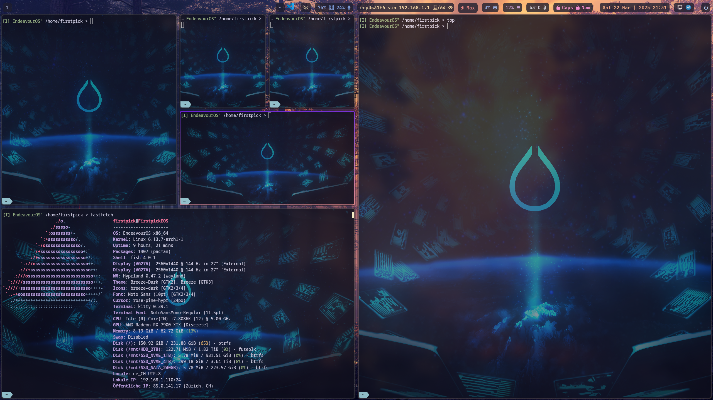

# Hyprland Setup

## Table of Contents
- [Introduction](#introduction)
- [Environment Setup](#environment-setup)
- [Prerequisites](#prerequisites)
- [Setup Script Execution](#setup-script-execution)
- [Dependencies](#dependencies)
  - [Pacman Packages](#pacman-packages)
  - [AUR Extras](#aur-extras)
- [Installation & Configuration](#installation--configuration)
- [Running the Wallpaper Script](#running-the-wallpaper-script)
- [Customization](#customization)
  - [Wallpaper Management](#wallpaper-management)
  - [Window Rules](#window-rules)
  - [Keybindings](#keybindings)
  - [Appearance](#appearance)
  - [Autostart Applications](#autostart-applications)
  - [Monitor Configuration](#monitor-configuration)
  - [Performance Tweaks](#performance-tweaks)
- [Troubleshooting](#troubleshooting)
  - [Display and Monitor Issues](#display-and-monitor-issues)
  - [Wallpaper Management](#wallpaper-management-1)
  - [Authentication Issues](#authentication-issues)
  - [Performance Problems](#performance-problems)
  - [Application Integration](#application-integration)
  - [Configuration Debugging](#configuration-debugging)
  - [Keybinding Issues](#keybinding-issues)
  - [Recovery Options](#recovery-options)
- [Features](#features)
  - [Terminal Experience](#terminal-experience)
  - [Window Management](#window-management)
  - [Notification System](#notification-system)
  - [Visual Customization](#visual-customization)
  - [Security Features](#security-features)
  - [Performance Optimizations](#performance-optimizations)
- [Additional Resources](#additional-resources)

## Example Image


## Example Terminal and Musik Visualizer




## Introduction

This repository provides a comprehensive yet minimalistic Hyprland setup designed for users who want a modern, efficient, and customizable desktop environment. The configuration focuses on:

### Key Features
- **Simplicity**: Straightforward installation and configuration process
- **Performance**: Optimized settings for smooth operation
- **Flexibility**: Easy customization options for personal preferences
- **Integration**: Seamless compatibility with modern Linux tools and applications

### Design Philosophy
The setup follows these principles:
- Minimal dependencies while maintaining full functionality
- Sensible defaults that work out of the box
- Clear configuration structure for easy modification
- Performance-focused settings without sacrificing features

### Target Users
This setup is ideal for:
- Users transitioning from traditional desktop environments to Hyprland
- Developers seeking a efficient, keyboard-driven workflow
- Anyone interested in modern Wayland-based desktop setups

### What's Included
- Complete Hyprland configuration with optimal defaults
- Dynamic wallpaper management system
- Integrated notification and status system
- Modern terminal environment with fish shell
- Security features including screen locking and authentication
- Performance optimizations for various hardware configurations

## Environment Setup

- The Setup is designed to run from EndeavourOS with KDE preinstalled. 
- You may need to modify the script for other distros or environments.

## Prerequisites
- [Hyprland](https://hyprland.org/) installed.
- Utilities like `hyprctl`, `hyprpaper`, and a shell environment.
- A directory containing your wallpapers.
- Vivaldi is used for browser in hyprland.conf, change it if you want to use another browser.
- Check Monitors in hyprland.conf at the start. Adapt it to your setup.

## Setup Script Execution

To install and configure Hyprland along with its dependencies, run:
```bash
./Start_hyprland_setup.sh
```
This script automatically updates Pacman, installs the necessary packages, and configures Hyprland tools.

## Dependencies

### Pacman Packages
- hyprland
- dolphin (File Manager)
- vivaldi (Browser)
- kitty (Terminal)
- waybar (Status Bar)
- hyprpaper (Dynamic Wallpaper Manager)
- wofi (App Launcher with)
- hyprlock (Lock Screen)
- hypridle (Idle Manager)
- hyprpolkitagent (Authentication Agent)
- polkit-kde-agent (Authentication Agent)
- gnome-keyring (Authentication Agent)
- xdg-desktop-portal-hyprland (Desktop Integration)
- xdg-desktop-portal-gtk (Desktop Integration)
- dunst (Notification Daemon)
- ttf-jetbrains-mono-nerd (Fonts)
- fish (Shell)
- bat (cat replacement - used as alias in fish config)
- lsd (ls replacement - used as alias in fish config)
- btop (System Monitor - used as alias in fish config)
- nwg-displays (Display Manager to handle multiple monitors)

`sudo pacman -S hyprland dolphin kitty vivaldi waybar hyprpaper hyprcursor wofi hyprlock hypridle hyprpolkitagent xdg-desktop-portal-hyprland xdg-desktop-portal-gtk dunst gnome-keyring ttf-jetbrains-mono-nerd cava polkit-kde-agent fish bat lsd btop nwg-displays`

### AUR Extras
- xwaylandvideobridge-git (XWayland Video Bridge)
- hyprshot (Screenshot Tool)
- Visual Studio Code (Text Editor)

`yay -S xwaylandvideobridge-git hyprshot visual-studio-code-bin`

## Installation & Configuration

1. Clone or copy this repository to your machine.
2. Update the following files with your system-specific details:
   - **Wallpaper Configuration:**  
     Create or edit `~/.config/hypr/sources/change_wallpaper.conf` with:
     ```bash
     # Your wallpaper directory path
     WALLPAPER_DIR="$HOME/Pictures/Wallpapers"
     
     # Your monitor names (check with hyprctl monitors)
     MONITORS=(
         "DP-1"
         "HDMI-A-1"
         # Add more monitors as needed
     )
     ```
   - **Hyprlock Wallpaper Path:**  
     Update the `background` path in `~/.config/hypr/hyprlock.conf` to match your wallpaper directory.
     
   - **Display Configuration:**  
     Create or edit `~/.config/hypr/sources/displays.conf` to match your monitor setup:
     ```bash
     monitor=DP-1,2560x1440@144,0x0,1
     monitor=HDMI-A-1,1920x1080@60,2560x0,1
     # Add more monitor configurations as needed
     ```

   - **Environment Variables:**  
     Check `~/.config/fish/config.fish` for correct language settings:
     ```fish
     set -gx LC_ALL de_CH.UTF-8  # Change to your locale
     set -gx LANG de_CH.UTF-8    # Change to your locale
     set -gx LANGUAGE de_CH:en_US # Change to your language preferences
     ```

## Running the Wallpaper Script

The `change_wallpaper.sh` script:
- Checks if hyprpaper is running and starts it if necessary.
- Picks a random wallpaper from your specified directory (excluding the current one).
- Applies the new wallpaper to the specified monitors.

To run the script (Default Key Shortcut: Super(mainMod) + W):
```bash
./.config/hypr/change_wallpaper.sh
```

## Customization

### Wallpaper Management
- Modify supported file extensions in `change_wallpaper.sh`:
  ```bash
  # Add or remove file extensions
  WALLPAPER=$(find "$WALLPAPER_DIR" -type f \( -iname "*.jpg" -o -iname "*.png" -o -iname "*.webp" \))
  ```
- Configure wallpaper transition effects in `hyprpaper.conf`:
  ```ini
  ipc = on
  preload = ~/path/to/default.jpg
  splash = true
  ```

### Window Rules
- Add custom window rules in `hyprland.conf`:
  ```ini
  # Example window rules
  windowrule = float, ^(pavucontrol)$
  windowrule = center, ^(pavucontrol)$
  windowrule = workspace 2, ^(vivaldi-stable)$
  windowrule = opacity 0.95, ^(Code)$
  ```

### Keybindings
- Customize shortcuts in `~/.config/hypr/sources/keybindings.conf`:
  ```ini
  # Media controls
  bind = , XF86AudioPlay, exec, playerctl play-pause
  bind = , XF86AudioNext, exec, playerctl next
  
  # Screenshot bindings
  bind = , Print, exec, hyprshot -m output
  bind = SHIFT, Print, exec, hyprshot -m region
  ```

### Appearance
- Modify Waybar styling in `style.css`:
  ```css
  /* Adjust transparency and colors */
  window#waybar {
    background: rgba(21, 18, 27, 0.8);
    color: #ffffff;
  }
  ```
- Configure Wofi menu appearance:
  ```css
  /* Customize menu size and colors */
  window {
    margin: 5px;
    background-color: #1e1e2e;
    border-radius: 15px;
  }
  ```

### Autostart Applications
- Add or modify autostart programs in `~/.config/hypr/sources/exec_once.conf`:
  ```bash  
  # User applications
  exec-once = vivaldi-stable
  exec-once = [workspace 3] code
  ```

### Monitor Configuration
- Advanced monitor setup examples:
  ```bash
  # High refresh rate gaming monitor
  monitor = DP-1,2560x1440@165,0x0,1
  
  # Vertical secondary monitor
  monitor = HDMI-A-1,1920x1080@60,2560x0,1,transform,1
  
  # Scale for HiDPI
  monitor = DP-2,3840x2160@60,5440x0,1.5
  ```

### Performance Tweaks
- Adjust animation settings for better performance:
  ```ini
  animations {
    enabled = yes
    animation = windows,1,3,default    # Faster window animations
    animation = border,1,2,default     # Quicker border animations
    animation = fade,0                 # Disable fade for better performance
  }
  ```
- Configure misc options for optimization:
  ```ini
  misc {
    vfr = true                        # Variable refresh rate
    disable_hyprland_logo = true      # Disable startup logo
    disable_splash_rendering = true    # Disable splash screen
  }
  ```

For more customization options, refer to:
- [Hyprland Configuration Reference](https://wiki.hyprland.org/Configuring/Variables/)
- [Waybar Configuration Guide](https://github.com/Alexays/Waybar/wiki/Configuration)
- [Wofi Documentation](https://hg.sr.ht/~scoopta/wofi)

## Troubleshooting

### Display and Monitor Issues
- Verify monitor names and configurations:
  ```bash
  # List all monitors and their current status
  hyprctl monitors
  
  # Check for any monitor hotplug events
  tail -f ~/.local/share/hyprland/hyprland.log | grep -i "monitor"
  ```
- If monitors are not detected properly:
  1. Ensure your GPU drivers are properly installed
  2. Try adding manual monitor configuration to `hyprland.conf`
  3. Check if your display cable is properly connected

### Wallpaper Management
- Wallpaper not changing:
  ```bash
  # Check if wallpaper directory exists and has correct permissions
  ls -la $WALLPAPER_DIR
  
  # Verify hyprpaper is running
  ps aux | grep hyprpaper
  
  # Check hyprpaper socket status
  ls -l /tmp/hypr
  ```
- Invalid wallpaper formats:
  1. Ensure images are in supported formats (jpg, png, webp)
  2. Check image file permissions
  3. Run `file` command on images to verify format

### Authentication Issues
- If polkit authentication fails:
  ```bash
  # Check if polkit agent is running
  ps aux | grep polkit
  
  # Restart polkit service
  systemctl restart polkit
  ```
- For keyring issues:
  1. Verify gnome-keyring is installed and running
  2. Check if PAM is properly configured

### Performance Problems
- For slow startup or lag:
  ```bash
  # Check startup time
  hyprctl version
  
  # Monitor resource usage
  htop
  
  # Check for GPU issues
  nvidia-smi  # For NVIDIA GPUs
  radeontop   # For AMD GPUs
  ```
- Reduce animation complexity in `hyprland.conf` if needed

### Application Integration
- XWayland applications not working:
  ```bash
  # Check if XWayland is running
  ps aux | grep Xwayland
  
  # Verify application compatibility
  echo $XDG_SESSION_TYPE
  ```
- Screen sharing issues:
  1. Ensure xdg-desktop-portal-hyprland is installed
  2. Check if necessary protocols are supported
  3. Verify xwaylandvideobridge is running for screen sharing

### Configuration Debugging
- Parse configuration errors:
  ```bash
  # Check Hyprland logs
  less ~/.local/share/hyprland/hyprland.log
  
  # Validate config syntax
  hyprctl reload
  ```
- Common configuration fixes:
  1. Check file permissions of config files
  2. Verify paths in configuration files are absolute
  3. Ensure no syntax errors in configuration files

### Keybinding Issues
- Test if keybindings are registered:
  ```bash
  # List all active bindings
  hyprctl binds
  
  # Monitor key events
  wev  # Install wev package if needed
  ```
- For non-working shortcuts:
  1. Check for conflicts with system shortcuts
  2. Verify correct syntax in keybindings configuration
  3. Ensure required programs are installed

### Recovery Options
- If Hyprland fails to start:
  1. Switch to another TTY (Ctrl+Alt+F2)
  2. Check logs: `less ~/.local/share/hyprland/hyprland.log`
  3. Try with minimal config: `mv ~/.config/hypr/hyprland.conf ~/.config/hypr/hyprland.conf.bak`

For persistent issues:
- Check [Hyprland GitHub Issues](https://github.com/hyprwm/Hyprland/issues)
- Join the [Hyprland Discord](https://discord.gg/hQ6M6xbvEM)
- Review system logs: `journalctl -b -p err`

## Features

### Terminal Experience
- **Kitty Terminal Integration**
  - GPU-accelerated rendering for smooth performance
  - True color and ligature support
  - Multiple layouts (splits, tabs, windows)
  - Session management and restoration
  - Custom key mappings:
    ```bash
    # Quick terminal splits
    ctrl+shift+enter -> new window
    alt+h/j/k/l -> window navigation
    ctrl+shift+t -> new tab
    ```

- **Fish Shell Enhancements**
  - Smart command history with search
  - Dynamic OS-aware prompt
  - Built-in completions and suggestions
  - Custom aliases for improved workflow:
    ```fish
    alias ls='lsd -lh --group-directories-first'
    alias top='btop'
    alias cat='bat'
    ```

- **Modern CLI Tools**
  - `bat`: Syntax highlighting for file viewing
  - `lsd`: Enhanced file listing with icons
  - `btop`: Resource monitoring with graphs
  - `fzf`: Fuzzy finding with preview
  - `fd`: Fast file search alternative

### Window Management
- **Dynamic Workspace Organization**
  - Per-monitor workspaces
  - Automatic workspace assignment rules
  - Smart window placement algorithms
  - Scratchpad support for temporary windows

- **Advanced Window Controls**
  - Edge snap and resize
  - Window grouping and tabbing
  - Floating window management
  - Window fade animations
  - Example rules:
    ```ini
    windowrule = workspace 1, ^(kitty)$
    windowrule = float, ^(pavucontrol)$
    windowrule = size 50% 60%, ^(pavucontrol)$
    windowrule = center, ^(pavucontrol)$
    ```

- **Multi-Monitor Support**
  - Independent workspace per monitor
  - Dynamic monitor hot-plugging
  - Variable refresh rate support
  - Mixed DPI configuration

### Notification System
- **Dunst Configuration**
  - Rich formatting support
  - Progress bar integration
  - Critical notification persistence
  - Custom styling per application
  - Action button support
  - Example notification features:
    ```ini
    # Progress notifications
    progress_bar = true
    progress_bar_height = 10
    progress_bar_corner_radius = 3
    
    # Smart positioning
    follow = mouse
    offset = 15x15
    ```

### Visual Customization
- **Waybar Integration**
  - Custom modules support
  - System tray integration
  - Workspace overview
  - Media player controls
  - Network management
  - Volume control
  - Battery monitoring
  - Example modules:
    ```json
    "custom/weather": {
        "format": "{}°",
        "interval": 3600,
        "exec": "weather-script.sh"
    }
    ```

- **Theme Management**
  - Dynamic color schemes
  - Wallpaper-based theming
  - Font configuration:
    - JetBrains Mono Nerd Font
    - Icon fonts support
    - Ligature enablement
  - Transparency effects

- **Application Styling**
  - GTK theme integration
  - Qt style harmonization
  - Cursor theme support
  - Icon theme consistency

### Security Features
- **Screen Locking**
  - Automatic screen locking
  - Custom lock screen styling
  - PAM integration
  - Multi-monitor support

- **Authentication**
  - Polkit integration
  - Keyring management
  - Secure screen sharing
  - XWayland isolation

### Performance Optimizations
- **Resource Management**
  - Compositor-level VSync
  - GPU acceleration
  - Smart process scheduling
  - Memory usage optimization

- **Startup Management**
  - Delayed autostart capability
  - Service dependency handling
  - Parallel loading optimization
  - Session restoration

## Additional Resources
- [Hyprland Wiki](https://wiki.hyprland.org/)
- [Hyprland GitHub Repository](https://github.com/vaxerski/Hyprland)
